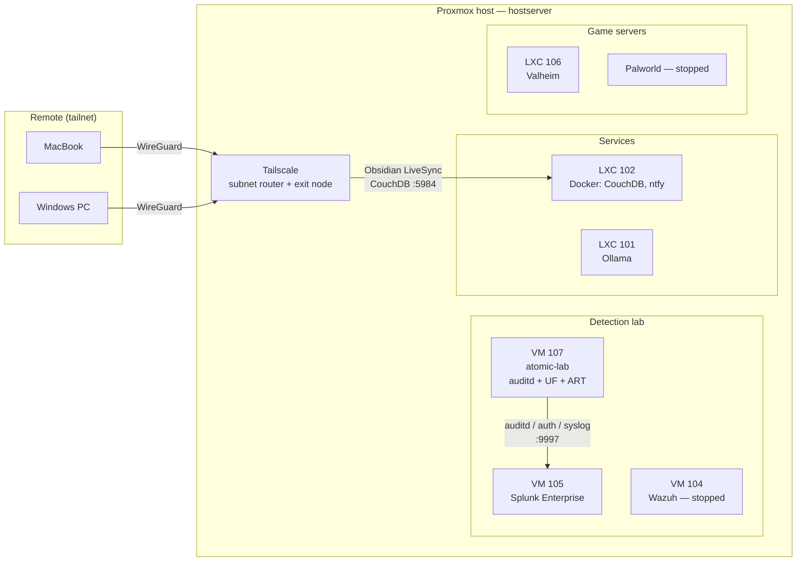

# 🏠 Homelab

A single-node Proxmox homelab I use to learn infrastructure, networking and — mostly — **security operations and detection engineering**.

> **Current focus:** a Splunk + Atomic Red Team detection lab. I run MITRE ATT&CK techniques against an isolated Linux VM, check what the SIEM catches, and write SPL detections for the gaps. See [`detection-lab/`](detection-lab/).

---

## At a glance

| | |
|---|---|
| **Hypervisor** | Proxmox VE on Debian (`hostserver`) |
| **RAM** | 16 GB — upgrading to 32 soon|
| **Storage** | ~338 GB thin LVM (VMs, snapshots) · ~1.8 TB thick LVM (bulk) · ~94 GB dir (ISOs, backups) |
| **Network** | remote access via Tailscale subnet router |
| **SIEM** | Splunk Enterprise 10.4 (active) · Wazuh 4.7 (archived) |

## Architecture



## Inventory

| ID | Name | Type | Role | Status |
|---|---|---|---|---|
| 101 | ollama | LXC | Local LLM inference | 🟢 Running |
| 102 | docker | LXC | CouchDB (Obsidian sync), ntfy | 🟢 Running |
| 104 | wazuh | VM | Wazuh SIEM — superseded by Splunk |
| 105 | splunk | VM | Splunk Enterprise 10.4.3 | 🟢 Running |
| 106 | valheim | LXC | Valheim dedicated server | 🟢 Running |
| 107 | atomic-lab | VM | Atomic Red Team target, auditd + Universal Forwarder | 🟢 Running |
| 100 | crafty-controller | LXC | Minecraft controller |
| 103 | palworld | LXC/VM | Palworld dedicated server|

## Repository layout

```
.
├── README.md                 
├── docs/
│   ├── architecture.md        
│   └── lessons-learned.md     ← things that broke and why
├── detection-lab/
│   ├── README.md              ← lab design + ATT&CK coverage table
│   ├── config/                ← auditd rules, forwarder inputs, saved searches
│   └── detections/            ← one write-up per technique
├── services/                  ← runbooks for each service
└── archive/wazuh/             ← the earlier Wazuh build
```

## Detection coverage

| Technique | Name | Detection | Status |
|---|---|---|---|
| [T1087.001](detection-lab/detections/T1087.001.md) | Local Account Discovery | SPL burst correlation | ✅ Done |
| T1053.003 | Cron | — |  ✅ Done |
| T1003.008 | /etc/passwd & /etc/shadow | — | Planned |
| T1136.001 | Create Account | — | Planned |

Full table: [`detection-lab/README.md`](detection-lab/README.md#coverage)

## Roadmap

- [x] Proxmox + Tailscale subnet routing
- [x] Wazuh SIEM with agents and SSH brute-force active response
- [x] Splunk Enterprise + auditd telemetry + Atomic Red Team
- [x] First custom detection (T1087.001)
- [Currently] Detections for T1053.003, T1003.008, T1136.001
- [ ] Windows Server 2022 domain controller (AD telemetry)
- [ ] Pi-hole + Tailscale MagicDNS
- [ ] Nginx Proxy Manager, Uptime Kuma, Portainer

## Skills demonstrated

`Proxmox` · `Linux administration` · `Splunk / SPL` · `auditd` · `Wazuh` · `MITRE ATT&CK` · `Atomic Red Team` · `Tailscale / WireGuard` · `Docker` · `systemd`

---

<sub>Credentials, public IPs and hardware identifiers are intentionally left out of this repo.</sub>
