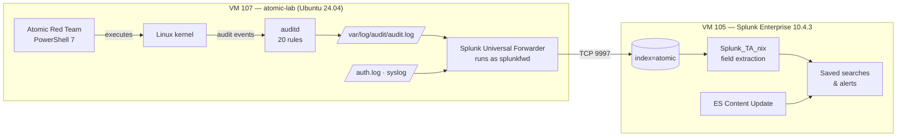
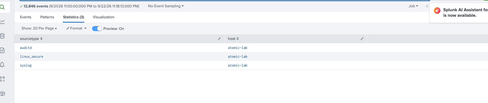
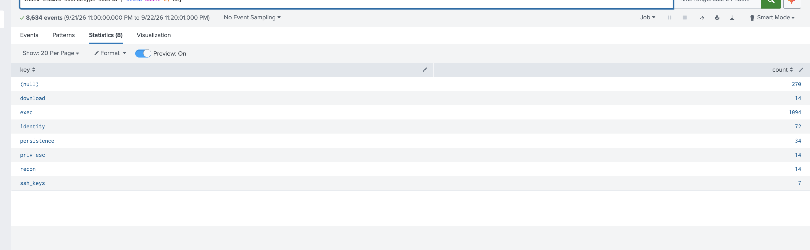

# Detection Engineering Lab

A purple-team loop: run a MITRE ATT&CK technique with Atomic Red Team, see whether
Splunk catches it, and write or tune a detection for the gap.

## Architecture



**Why a VM?** The Linux audit subsystem isn't namespaced, so auditd can't run in an
unprivileged container. A small VM gets its own kernel.

**Snapshots:** `clean-baseline` (auditd + forwarder) and `art-ready` (+ PowerShell +
ART). Every test ends in `-Cleanup` or a rollback to `art-ready`.

Pipeline check: all three sourcetypes arriving, and auditd keys parsed by the add-on.




## The loop

```powershell
Invoke-AtomicTest T1087.001 -ShowDetailsBrief
Invoke-AtomicTest T1087.001 -CheckPrereqs
Invoke-AtomicTest T1087.001
# → search Splunk: did ESCU fire? did my detection fire?
Invoke-AtomicTest T1087.001 -Cleanup
```

For every run I record: technique → existing content alert → search performed →
detection written → tuning applied.

## Coverage

| Technique | Name | Telemetry | Status |
|-----------|------|-----------|--------|
| T1087.001 | Local Account Discovery | `EXECVE` args | ✅ [Detection written & validated](detections/T1087.001.md) |
| T1053.003 | Cron | `persistence` key writes (`SYSCALL` + `PATH`) | ✅ [Detection written & validated](detections/T1053.003.md): **telemetry gap found and closed** |
| T1003.008 | /etc/passwd & /etc/shadow | `identity` key read of `/etc/shadow` | 🔜 Next |
| T1136.001 | Create Account | `useradd` execve + `identity` writes | Planned |
| T1059.004 | Unix Shell | `sh -c` execve chains | Planned |
| T1548.001 | Setuid and Setgid | `chmod u+s` | Planned |
| T1070.002 | Clear Linux Logs | truncation in `/var/log` | Planned |
| T1046 | Network Service Discovery | `nmap` execution | Planned |
| T1105 | Ingress Tool Transfer | `curl` / `wget` execution | Planned |
| T1057 | Process Discovery | `ps`, `top` enumeration | Planned |

## Config in this folder

| File | Purpose |
|------|---------|
| [`config/atomic.rules`](config/atomic.rules) | auditd rules: the telemetry foundation for detections |
| [`config/inputs.conf`](config/inputs.conf) | Universal Forwarder inputs |
| [`config/savedsearches.conf`](config/savedsearches.conf) | Detections as Splunk saved searches |
| [`detections/`](detections/) | One write-up per technique: what ran, what was seen, the SPL, tuning, gaps |
| [`evidence/`](evidence/) | Screenshots and raw CSV exports backing each write-up |

## Working notes on the data

- One `execve` produces several linked records: `SYSCALL` (who and what program),
  `EXECVE` (arguments) and `PATH` (file names).
- `auid` survives `sudo`, which attributes activity to the login user.
  `auid=1000 uid=0` means sudo.
- Rule reloads log `CONFIG_CHANGE` events that carry rule keys. Always pin key-based
  searches to `type=SYSCALL` so rule loads aren't treated as attacks.
- `/etc/shadow` gets a read watch (`-p rwa`) because legitimate reads are rare.
  `/etc/passwd` detection uses command lines instead.
- **Audit serials reset on every boot and snapshot rollback.** Correlate records on
  `timestamp:serial` from `msg=audit(<epoch>.<ms>:<serial>)`, not the serial alone.
  Grouping on the serial merged events from different days into one row.
- **Watch locations, not tools.** ART T1053.003-4 planted a cron job without ever
  running `crontab`. The file watch on the folder caught it anyway.
- **Test before trusting coverage.** The first rule set missed
  `/etc/cron.{hourly,daily,weekly,monthly}` entirely. One of the four cron tests was
  invisible until four watches were added.
