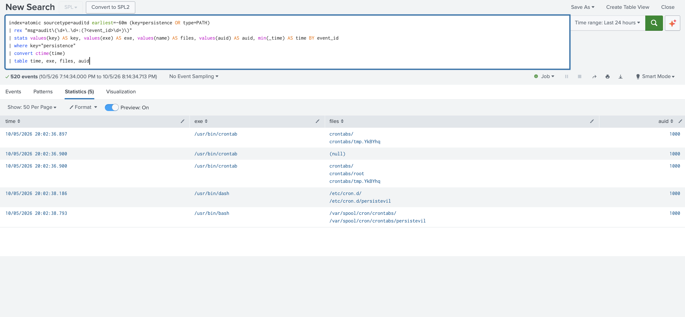
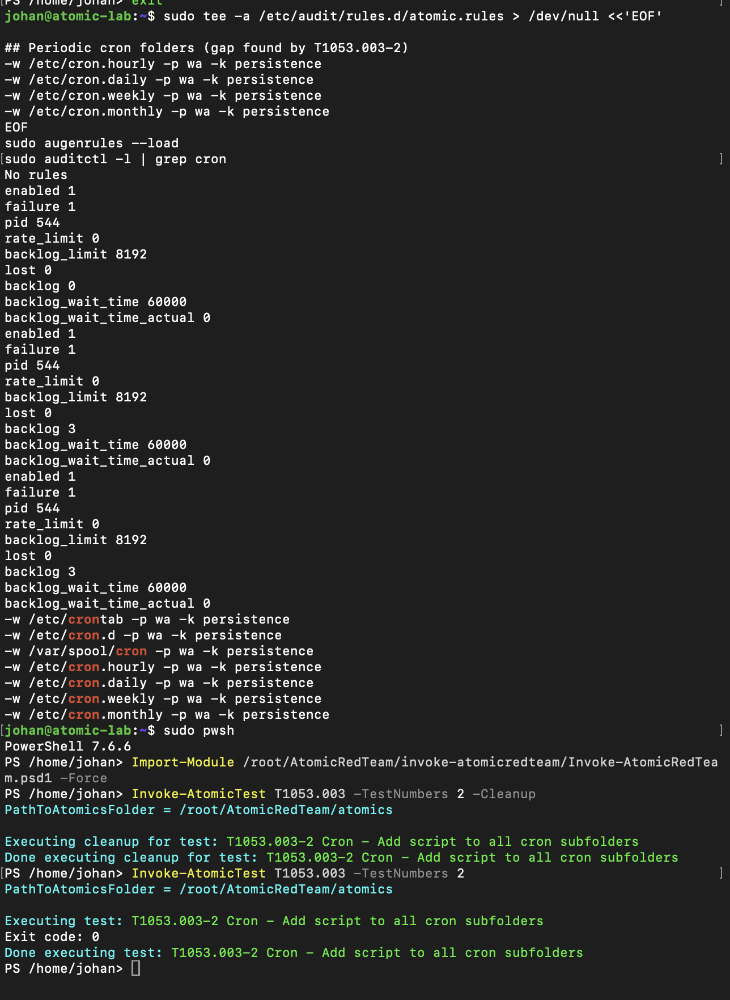
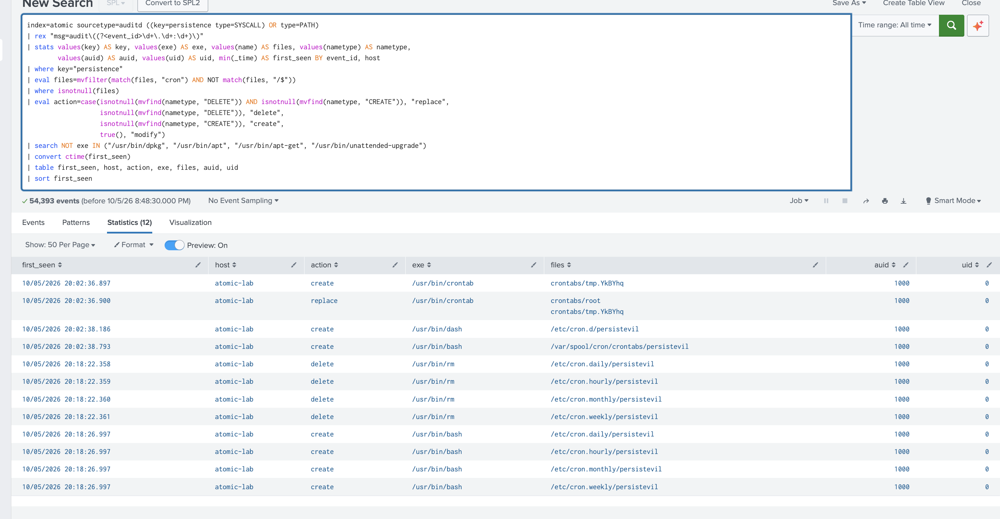

# T1053.003: Scheduled Task/Job: Cron

| | |
|---|---|
| **Tactic** | Persistence, Execution |
| **Run** | 2026-10-05, ART `Invoke-AtomicTest T1053.003` (all 4 tests, as root via `sudo pwsh`) |
| **Saved search** | `T1053.003 - Cron Persistence File Change` (in [`config/savedsearches.conf`](../config/savedsearches.conf)) |
| **Result** | ✅ Detected after a telemetry gap was found and fixed. All time: 12 rows, 0 false positives |
| **ESCU coverage** | Not yet recorded |

## The four tests

| Test | Method | First run | After fix |
|---|---|---|---|
| 1 Replace crontab | `crontab` writes `tmp.XXXX`, renames it to `crontabs/root` | ✅ `create` + `replace` | ✅ |
| 2 All cron subfolders | `bash` writes `persistevil` into `/etc/cron.{hourly,daily,weekly,monthly}` | ❌ **No events** | ✅ 4 × `create` |
| 3 `/etc/cron.d` | `dash` writes `/etc/cron.d/persistevil` | ✅ `create` | ✅ |
| 4 Spool | `bash` writes `/var/spool/cron/crontabs/persistevil` directly, without the `crontab` binary | ✅ `create` | ✅ |

## Gap found and closed

The original audit rules watched `/etc/crontab`, `/etc/cron.d` and `/var/spool/cron`,
but **not the periodic folders**. Test 2 was completely invisible.

Fix: four rules in [`config/atomic.rules`](../config/atomic.rules).

```
-w /etc/cron.hourly -p wa -k persistence
-w /etc/cron.daily -p wa -k persistence
-w /etc/cron.weekly -p wa -k persistence
-w /etc/cron.monthly -p wa -k persistence
```

Re-running only test 2 (`-TestNumbers 2`) then produced four `create` events. The
`-Cleanup` run before it produced four `rm` `delete` events, which shows the watches
also catch removal.

### Evidence

**Before:** the first run. Tests 1, 3 and 4 appear; nothing from the periodic folders.



**The fix:** the four watches loaded, then test 2 cleaned up and re-run.



**After:** the final detection over **All time**, 12 rows, all from the test.



Raw exports:

- [`raw-correlation-before-and-after-fix.csv`](../evidence/T1053.003/raw-correlation-before-and-after-fix.csv):
  the correlation search before filtering. It shows the rule-reload rows (no
  program) at 20:17 and 20:18, the cleanup deletes, and the new periodic-folder
  writes.
- [`serial-collision-bug-all-time.csv`](../evidence/T1053.003/serial-collision-bug-all-time.csv):
  the buggy version that grouped on serial alone. Note today's temp file
  `tmp.YkBYhq` appearing with a 2026-09-22 timestamp.

Test 4 matters because it never ran `crontab`. A detection keyed on the tool would
miss it. This detection watches the **location**, so it catches any writer.

## Telemetry

A file-watch hit puts the rule `key` on the `SYSCALL` record and the file name on
separate `PATH` records. The detection joins them on the audit event ID.

## Detection

```spl
index=atomic sourcetype=auditd ((key=persistence type=SYSCALL) OR type=PATH)
| rex "msg=audit\((?<event_id>\d+\.\d+:\d+)\)"
| stats values(key) AS key, values(exe) AS exe, values(name) AS files, values(nametype) AS nametype,
        values(auid) AS auid, values(uid) AS uid, min(_time) AS first_seen BY event_id, host
| where key="persistence"
| eval files=mvfilter(match(files, "cron") AND NOT match(files, "/$"))
| where isnotnull(files)
| eval action=case(isnotnull(mvfind(nametype, "DELETE")) AND isnotnull(mvfind(nametype, "CREATE")), "replace",
                   isnotnull(mvfind(nametype, "DELETE")), "delete",
                   isnotnull(mvfind(nametype, "CREATE")), "create",
                   true(), "modify")
| search NOT exe IN ("/usr/bin/dpkg", "/usr/bin/apt", "/usr/bin/apt-get", "/usr/bin/unattended-upgrade")
| convert ctime(first_seen)
| table first_seen, host, action, exe, files, auid, uid
| sort first_seen
```

## Tuning

| Decision | Why it's safe |
|---|---|
| `key=persistence type=SYSCALL` | Every `augenrules --load` logs a `CONFIG_CHANGE` per rule, carrying its key. Without this filter, rule reloads look like activity. |
| `event_id` = **timestamp + serial** | The audit serial restarts at every boot or snapshot rollback. Grouping on the serial alone merged a 2026-10-05 event with an unrelated 2026-09-22 one, giving wrong times and mixed files. It only showed up when the search ran over All time. |
| `match(files, "cron")` | The `persistence` key also covers `/etc/systemd/system` (T1543.002), which gets its own detection. |
| Drop paths ending in `/` | Each write also logs the parent directory. |
| `replace` when DELETE and CREATE both appear | `crontab` installs via rename. Checking DELETE first mislabelled it as `delete`. |
| Exclude `dpkg`, `apt`, `apt-get`, `unattended-upgrade` by **program**, not path | Updates legitimately drop files like `/etc/cron.daily/apt-compat`. Excluding by program means a script that `bash` drops into `cron.daily` still fires. |
| Admin `crontab` edits not suppressed | Cron changes on a server are rare and worth a look. In production, suppress known automation accounts by `auid`. |

## Known gaps

- `/etc/anacrontab`, systemd timers (T1053.006) and `at` jobs (T1053.002) aren't
  covered.
- File contents aren't visible. A legitimately named file in `cron.d` is caught, but
  you have to read it to judge it.
