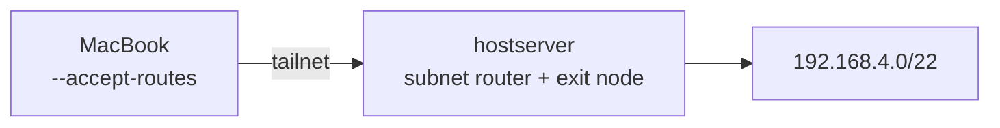

# Architecture

## Host

| | |
|---|---|
| **Hypervisor** | Proxmox VE on Debian |
| **Hostname** | `hostserver` |
| **RAM** | 15 GB |
| **Subnet** | `192.168.4.0/22` |

## Storage

| Pool | Type | Size | Use |
|---|---|---|---|
| `local` | dir | ~94 GB | ISOs, templates, `vzdump` backups |
| `local-lvm` | LVM-thin | ~338 GB | VM disks. **Snapshots supported** — the detection lab. | M.2 SSD
| `local-2tbhd` | LVM (thick) | ~1.8 TB | Bulk storage. **No snapshots**, so VMs here are backed up with `vzdump --mode stop`. | HDD

## Resource budget

RAM is what is holding me back in expanding my homelab 

| Running | ~RAM |
|---|---|
| ollama, docker, Valheim | ~4 GB |
| Splunk (VM 105) | 8 GB |
| atomic-lab (VM 107) | 2 GB |
| Host overhead | ~1 GB |
| **Total** | **~15 GB of 15** |

## Remote access — Tailscale

- `hostserver` advertises `192.168.4.0/22` and acts as an exit node.
- A systemd unit (`tailscale-up.service`) re-applies the subnet/exit-node flags on boot.
- IP forwarding is persisted in `/etc/sysctl.conf` (`net.ipv4.ip_forward=1`, `net.ipv6.conf.all.forwarding=1`).
- Tailscale SSH is enabled; no ports are forwarded to the internet for management.(Only port forwarding is for game servers and they are managed thru eero)

## Design decisions

| Decision | Reason |
|---|---|
| Attack tooling never runs on LXC 102 or the host | 102 holds My Docker containers where i store mt obsidian notes as well as my AI odyseuss web interface; the host runs everything. |
| Splunk runs as the `splunk` user | 
| Management only over Tailscale | No SSH or admin ports exposed to the internet. |
